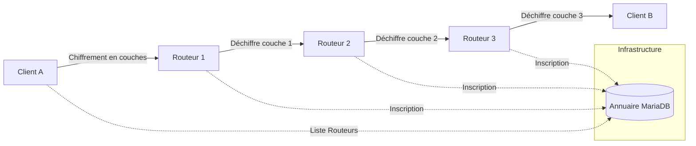

Projet SAE 3.02 : Routage en Oignon (Onion Routing)

> Conception d’une architecture distribuée avec routage en oignon pour l'anonymisation des flux.

## Auteurs
Groupe : Les pinguoins
- Quentin HARTMANN
- Akaza KOUAME

---

## Sommaire
1. [Présentation](#-présentation)
2. [Fonctionnalités](#-fonctionnalités)
3. [Architecture du Système](#-architecture-du-système)
4. [Installation Rapide](#-installation-rapide)
5. [Guide d'Utilisation](#-guide-dutilisation)
6. [Structure du Projet](#-structure-du-projet)
7. [Contraintes du Sujet](#-contraintes-du-sujet)

---

## Présentation
Ce projet implémente un système de **routage en oignon** (inspiré du réseau Tor) permettant d'anonymiser les communications réseau. L'idée est de faire transiter un message à travers plusieurs nœuds intermédiaires (routeurs), où chaque nœud ne connaît que son prédécesseur et son successeur immédiat.

---

## Fonctionnalités
- **Annuaire (Master)** : Serveur central gérant l'enregistrement des routeurs et la distribution de la liste aux clients.
- **Routeurs Oignon** : Nœuds de relais effectuant le déchiffrement d'une couche et la transmission au saut suivant.
- **Client Multi-Rôles** : Interface permettant d'envoyer des messages chiffrés et d'en recevoir.
- **Chiffrement Hybride** : Utilisation de **RSA** pour l'échange de clefs et **XOR** pour le payload (implémentation maison sans librairie crypto).
- **Routage Dynamique** : Choix du nombre de sauts (1 à 10) par le client.
- **Interface Graphique** : Interfaces modernes développées avec **PyQt5**.
- **Persistance** : Utilisation de **MariaDB** pour stocker l'état du réseau.

---

## Architecture du Système


---

## Commandes utiles
### Pour ajputer une nouvelle @IP 
```bash
sudo ip addr add 10.0.2.10/24 dev eth0
```
### Pour suprimer une @IP que l'on ne souhaite pas avoir
```bash
sudo ip addr del 10.0.2.15/24 dev eth0
```
### Pour démarer le service mariadb en cas de nécessitée (restart pour redémarer et stop pour l'éteindre) 
```bash
sudo service mariadb start
```
### Pour crée et configure l'utilisateur 'onion' avec tous les droits d'accès pour permettre aux scripts Python de se connecter à la base de données mariadb
```bash
sudo mysql -e "CREATE USER IF NOT EXISTS 'onion'@'localhost' IDENTIFIED BY 'onion'; ALTER USER 'onion'@'localhost' IDENTIFIED BY 'onion'; GRANT ALL PRIVILEGES ON *.* TO 'onion'@'localhost' WITH GRANT OPTION; FLUSH PRIVILEGES;"
```

---

## Guide d'Utilisation

1. **Démarrer l'Annuaire** : `python3 directory_node.py` -> Cliquez sur "Lancer le serveur".
2. **Démarrer les Routeurs** : Lancez 3* le script `routeur.py` -> Cliquez sur "Démarrer".
3. **Lancer les Clients** : `python3 client.py` (ouvrez-en deux pour tester la communication).

---

## Structure du Projet
- `crypto_utils.py` : Cœur cryptographique (RSA, XOR, Nombres premiers).
- `db.py` : Interface avec la base de données MariaDB.
- `directory_node.py` : Serveur d'annuaire avec interface graphique.
- `routeur.py` : Nœud de routage intermédiaire.
- `client.py` : Application utilisateur (envoi et réception).

---

## Contraintes du Sujet
- **Bibliothèques Interdites** : `json`, `cryptography`.
- **Bibliothèques Imposées** : `Socket`, `Thread`, `PyQt5`, `MariaDB`.
- **Algorithme** : Chiffrement RSA implémenté.
