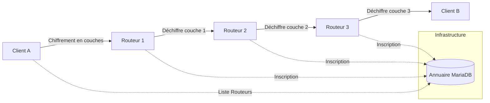

# 🧅 Projet SAE 3.02 : Routage en Oignon (Onion Routing)

> **Conception d’une architecture distribuée avec routage en oignon pour l'anonymisation des flux.**

---

## 📖 Sommaire
1. [Présentation](#-présentation)
2. [Fonctionnalités](#-fonctionnalités)
3. [Architecture du Système](#-architecture-du-système)
4. [Installation Rapide](#-installation-rapide)
5. [Guide d'Utilisation](#-guide-dutilisation)
6. [Structure du Projet](#-structure-du-projet)
7. [Contraintes du Sujet](#-contraintes-du-sujet)
8. [Auteurs](#-auteurs)

---

## 🎯 Présentation
Ce projet implémente un système de **routage en oignon** (inspiré du réseau Tor) permettant d'anonymiser les communications réseau. L'idée est de faire transiter un message à travers plusieurs nœuds intermédiaires (routeurs), où chaque nœud ne connaît que son prédécesseur et son successeur immédiat.

---

## ✨ Fonctionnalités
- ✅ **Annuaire (Master)** : Serveur central gérant l'enregistrement des routeurs et la distribution de la liste aux clients.
- ✅ **Routeurs Oignon** : Nœuds de relais effectuant le déchiffrement d'une couche et la transmission au saut suivant.
- ✅ **Client Multi-Rôles** : Interface permettant d'envoyer des messages chiffrés et d'en recevoir.
- ✅ **Chiffrement Hybride** : Utilisation de **RSA** pour l'échange de clefs et **XOR** pour le payload (implémentation maison sans librairie crypto).
- ✅ **Routage Dynamique** : Choix du nombre de sauts (1 à 10) par le client.
- ✅ **Interface Graphique** : Interfaces modernes développées avec **PyQt5**.
- ✅ **Persistance** : Utilisation de **MariaDB** pour stocker l'état du réseau.

---

## 🏗️ Architecture du Système


---

## ⚡ Installation Rapide

### 1. Dépendances
```bash
# Installation automatique (recommandé)
sudo python3 install_dependencies.py

# Ou manuelle
pip3 install PyQt5 mysql-connector-python sympy
sudo apt install mariadb-server
```

### 2. Base de Données
```bash
# Création de l'utilisateur
sudo mysql -e "CREATE USER IF NOT EXISTS 'onion'@'localhost' IDENTIFIED BY 'onion'; GRANT ALL PRIVILEGES ON *.* TO 'onion'@'localhost'; FLUSH PRIVILEGES;"

# Initialisation
python3 db.py
```

---

## 🚀 Guide d'Utilisation

1. **Démarrer l'Annuaire** : `python3 directory.py` -> Cliquez sur "Lancer le serveur".
2. **Démarrer les Routeurs** : Lancez 3 instances de `router.py` -> Cliquez sur "Démarrer".
3. **Lancer les Clients** : `python3 client.py` (ouvrez-en deux pour tester la communication).

> [!IMPORTANT]
> Consultez le [GUIDE_INSTALLATION.md](GUIDE_INSTALLATION.md) pour les détails sur la configuration réseau entre plusieurs VMs.

---

## 📂 Structure du Projet
- 🛠️ `crypto.py` : Cœur cryptographique (RSA, XOR, Nombres premiers).
- 🗄️ `db.py` : Interface avec la base de données MariaDB.
- 📋 `directory.py` : Serveur d'annuaire avec interface graphique.
- 🔄 `router.py` : Nœud de routage intermédiaire.
- 👤 `client.py` : Application utilisateur (Envoi/Réception).
- 📜 `install_dependencies.py` : Script d'automatisation de l'installation.

---

## ⚖️ Contraintes du Sujet
- **Bibliothèques Interdites** : `json`, `cryptography` (Respecté : protocole texte et RSA maison).
- **Bibliothèques Imposées** : `Socket`, `Thread`, `PyQt5`, `MariaDB` (Utilisées).
- **Algorithme** : Chiffrement asymétrique RSA implémenté de zéro.

---

## 👥 Auteurs
**Groupe : [NOM DU GROUPE]**
- **Quentin [NOM]**
- [NOM MEMBRE 2]
- [NOM MEMBRE 3]

*Projet réalisé dans le cadre de la SAE 3.02 - Réseaux & Télécoms (2025).*

---
## 📄 Licence
Projet à but éducatif - SAE 3.02.


# Update Gantt Phase 1
# Update Gantt Phase 2
